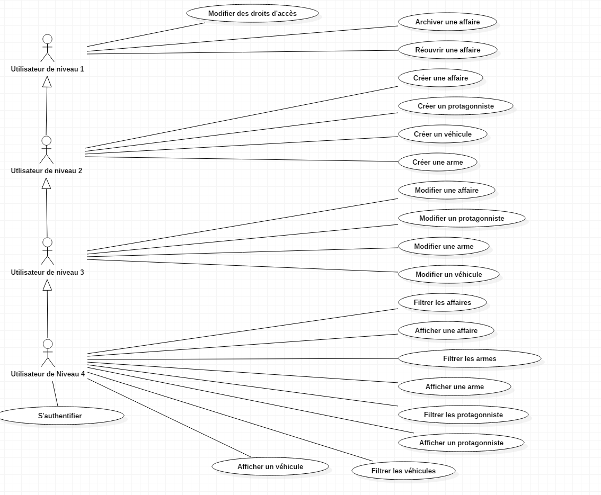

        # Evaluation CRUD
## MODE OPÉRATOIRE

### Prérequis (Back)
- Java 1,8
- Maven (+ commandes exécuter/déployer)

- SGBDR MySQL
- schema.sql (création de la base et des tables)
- data.sql (obtention des données)

#### Modifications nécessaires [Lien fichier properties](https://github.com/milk42/Back-CRUD-evaluation/blob/master/src/main/resources/application.properties)
- spring.datasource.url=jdbc:mysql :
- spring.datasource.username
- spring.datasource.password

- Si besoin de changer le port du serveur Tomcat,  ajouter la ligne : 
server.port: XXXX

### Prérequis (Front)
- NodeJS

### Lancement

#### Back
Via GitHub :
1. Cloner le repo
2. Ajouter le projet à votre IDE préférée
3. Faire un ```MVN Clean Install```
4. Faire un Maven Update Project
5. Lancer l’application via : Run as Spring Boot App

## Projet
Projet fil rouge : Faire une application pour les experts de Miami en équipe.
Démontrer l'utilisation du CRUD.

## DIAGRAMMES

### USECASE



### Diagramme de classe


### DIAGRAMMES D’ACTIVITE

- CONNEXION


- GESTION DES UTILISATEURS


- GESTION DES AFFAIRES


- GESTION DES ARMES


- GESTION DES VEHICULES


### DIAGRAMME DE CLASSES


### MOCKUPS

- PAGE D’ACCUEIL


- PAGE DE L’ADMINISTRATEUR


- PAGES DES AFFAIRES


- PAGES DES ARMES


- PAGES DES SUSPECTS


- PAGES DES VEHICULES


## Technologies
Sous éclipse: 
  -programme en JAVA Spring Boot et ustilisation de l'ORM Hibernate pour créer la base de données en programmant.
## Evaluation des compétences
Réalisation du programme: 
  - Toutes les classes (model) de A à Z  ainsi que leur controller en passant par l'interface JPArepository
    organisé par [packages](https://github.com/milk42/Back-CRUD-evaluation/tree/master/src/main/java/co/simplon).
  - Vous trouverez des commentaires sur le suivi de la classe Suspect avec l'utilisation de JPA Hibernate.
      . [SuspectModel]() 
      . [iRepositorySuspect]()
      . [SuspectController]()
## Structure du projet
Programme réalialisé avec le pattern MVC
SuspectModèle : Classe @Entity décrivant l'objet suspect avec les décorations d'Hibernate
                pour donner un comportement aux attributs afin de structurer la base de données.
IRepositorySuspect : Interface implémentée de JPArepository contenant les méthodes pour les requêtes sql de base.
SuspectController : Classe s'occupant de l'Api, les requêtes SQL étant cachées derrière les méthodes de JPArepository :
                   celles-ci seront inscritent en commentaires.

## INSTALLATION
### Création d'une base de donnée vide
Via les lignes de commande SQL:
```
CREATE DATABASE gedesaft_v2
```
### Récupération du projet
Le projet se trouve dans mon GITHUB à l'adresse suivante:
[Lien GITHUB milk42](https://github.com/milk42/Back-CRUD-evaluation)
### Ouvrir le projet dans éclipse
Changer le mot de passe existant avec le votre dans l'application properties
sur la ligne suivante: 
```
spring.datasource.password=
```
En lançant l'application (run as Application java), la connexion au port:8080 s'initialise,
il vous est donc possible de tester ce programme en créant (test du CRUD) des suspects par exemple, directement
depuis les lignes de commande SQL ou via POSTMAN.

/////////////////////////////////////////////////////////////////////////////////////////////////////////////////////////////


### SCHEMA SQL


### SCRIPTS SQL

#### /!\ LES SCRIPTS SQL SONT CONSULTABLES DANS LE DOSSIER DOCUMENTS /!\

- documents/Schema.mwb
- documents/filrouge_shema.sql
- Rappel : Pour l’obtention des données, le fichier “data.sql” est nécessaire et bien présent dans le projet (/Fil_Rouge/src/main/resources/data.sql)

## REQUÊTES SQL

- Le framework (Java) utilisé est Hibernate.  
Les requêtes SQL sont alors automatiquement traitées.  
C’est pourquoi, des commentaires ont été intégrés dans les Controllers (/Fil_Rouge/src/main/java/co/simplon/filrouge/controller) afin de visualiser les requêtes SQL correspondantes.


# @Author Davy

## BACK

- DataBase / Requêtes (MySQL Workbench - Travail groupé)
- CRUD Véhicule
- Gestion (création/suppression) liens vehicule/affaire
- Requête affichage des affaires liées à un véhicule
- Gestion de la recherche de la page véhicule
- Tests unitaires

### Fichiers JAVA gérés :
- AffaireController
- Vehicule (model) 
- VehiculeController
- VehiculeDAO
- VehiculeService
- VehiculeRepository
- VehiculeControllerTest


## FRONT

- Page véhicule

### Fichiers ANGULAR gérés :
- vehicule.component (.css/.html/.ts) 
- affaires-liées_au_vehicule.component(.css/.html/.ts)
- ivehicule.ts
- vehicule.service.ts
- api.service.ts
- app.module.ts


## SAUVEGARDE

- GITHUB (sauvegarde/récupération de version de projet et gestion des conflits)
